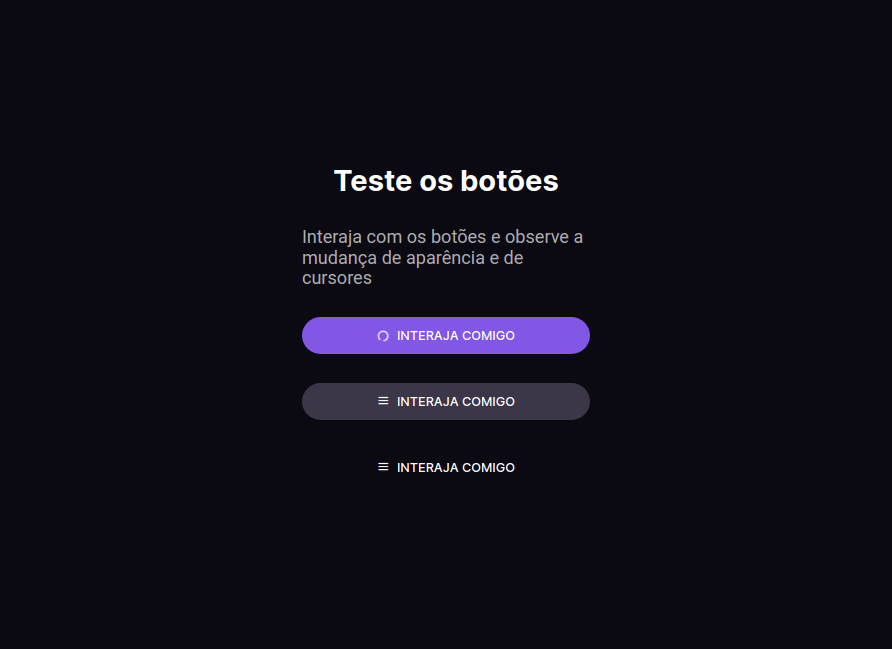

# Desafio 3 - Documentação de botões e ícones

  <a href="#layout">Layout</a> |
  <a href="#projeto">Projeto</a> |
  <a href="#tecnologias">Tecnologias</a> |
  <a href="#autor">Autor</a>

 

O projeto, é mais um desafio do programa da Rocketseat Bora Codar. O intuito do programa é mostrarmos nossas habilidades que estamos adquirindo com nossos estudos, com o projeto finalizado postamos em nossas redes sociais com a hastag #boracodar marcando a Rocketseat. Toda quarta-feira as 11 da manhã é lançado um novo desafio, é no Youtube da Rocket o professor Mayk Brito vem com sua solução do projeto passado. Acesse o site <a href="https://www.boracodar.dev">Bora Codar</a> é participe!

 

# Layout

 

# Deploy

<a href="">Deploy do projeto</a>

 

# Projeto

Projeto é uma documentação de botões e icones.

 

# Tecnologias

Essas foram as tecnologias utilizadas no projeto

- HTML
- CSS
- JavaScript
- Phosphor Icons
- Git é GitHub

 

# Autor

 
Bruno Gonçalves Ferreira
 
 

 

